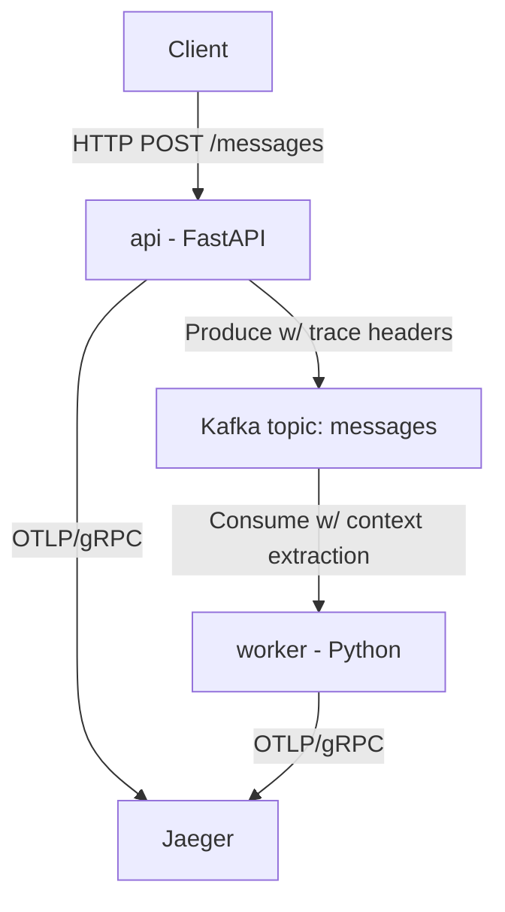
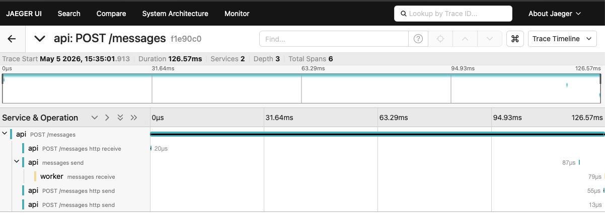

# otel-platform-demo

Proving trace instrumentation across async (disconnected) systems.  FastAPI Python app -> Kafka -> Python worker consuming.  Jaeger contain to view the traces.

## Architecture



## What the trace looks like

<!--  -->

1. **api POST /messages** - Parent span
2. **api POST /messages http receive** - FastAPI app receiving message from client
3. **api messages send** - FastAPI app posting message to Kakfa (messages is the name of the topic)
4. **worker messages receive** - Worker processing message from queue
5. **api POST /messages http send** - http.response.start - Headers of response from FastAPI back to client (message queued)
6. **api POST /messages http send** - http.response.body - Response body from FastAPI back to client (message queued)

Not entirely sure why there are two spans for the one message at the end.

## Running the demo

```bash
docker compose up --build
```

First boot takes around 30 secs.  Send a message:

```bash
curl -X POST http://localhost:8000/messages \
  -H 'Content-Type: application/json' \
  -d '{"body": "hello"}'
```

Open Jaeger at [http://localhost:16686](http://localhost:16686), select service **api**, click **Find Traces**, and open the most recent trace. You should see spans from both `api` and `worker` services.

## Running the tests

```bash
# api tests
cd api && pip install -r requirements-dev.txt && pytest -q

# worker tests
cd ../worker && pip install -r requirements-dev.txt && pytest -q
```

The tests mock Kafka (no infra required).  API overrides kafka with `MagicMock` in tests.  Worker's `consume_one()` accepts any iterator.  Tests pass a list of mock messages.

## Roadmap

- [] Auto-intrumentation: Custom metrics and structured logs via OTel
- [] Manual instrumentation: explicit span creation and context propagation across Kafka
- [] Manual instrumentation: custom metrics and structured logs
- [] Browser instrumentation: JS frontend with traces going: browser -> API -> Kafka -> worker